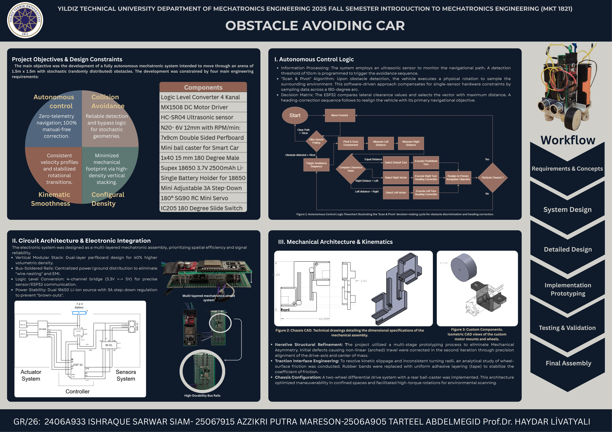
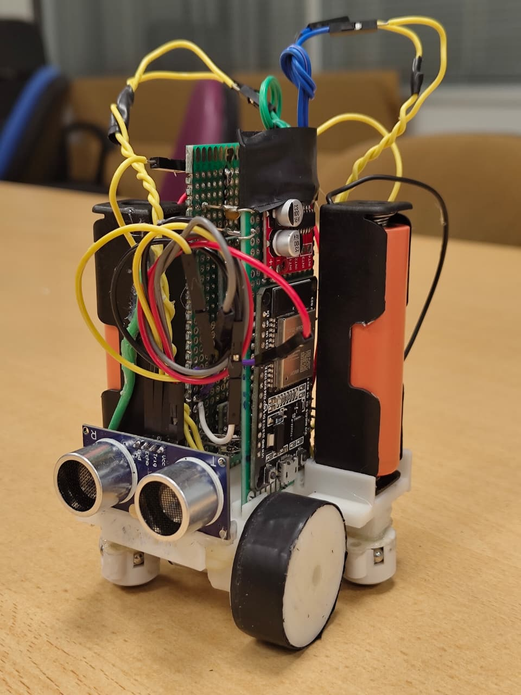
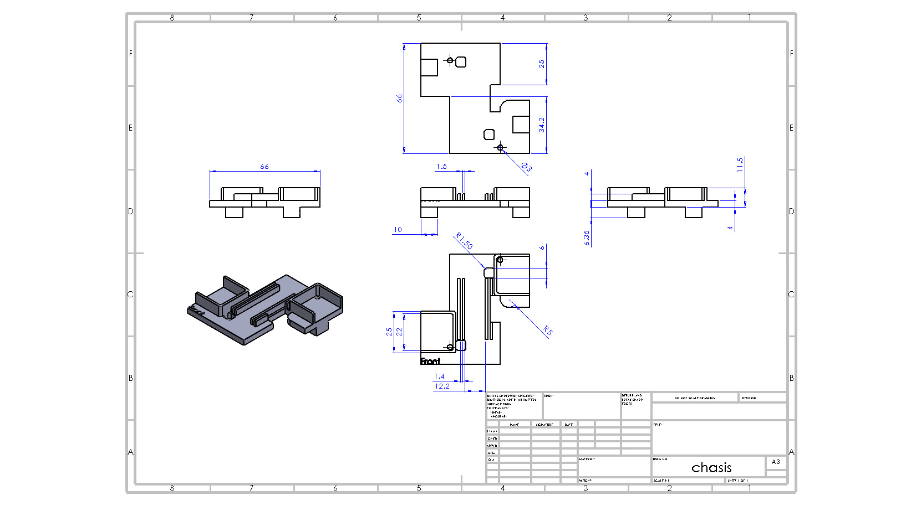
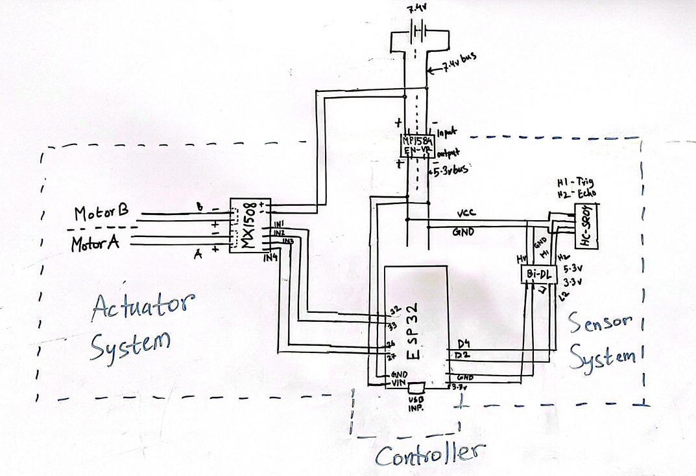
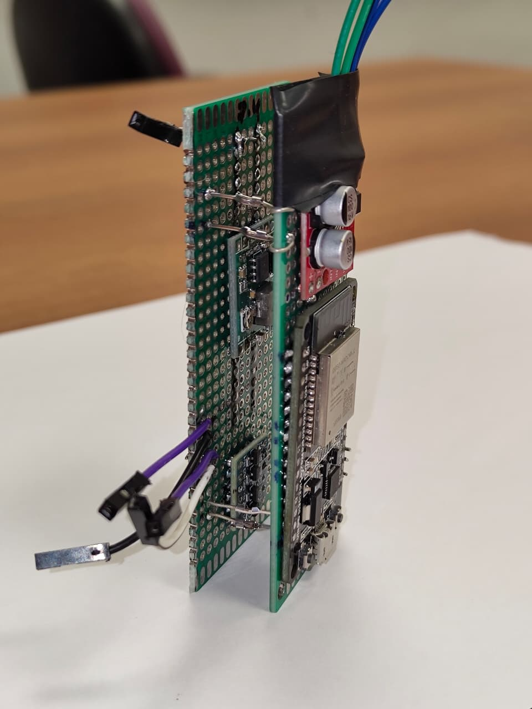
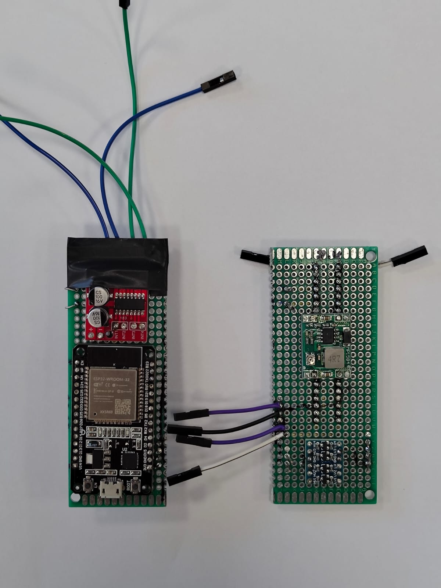
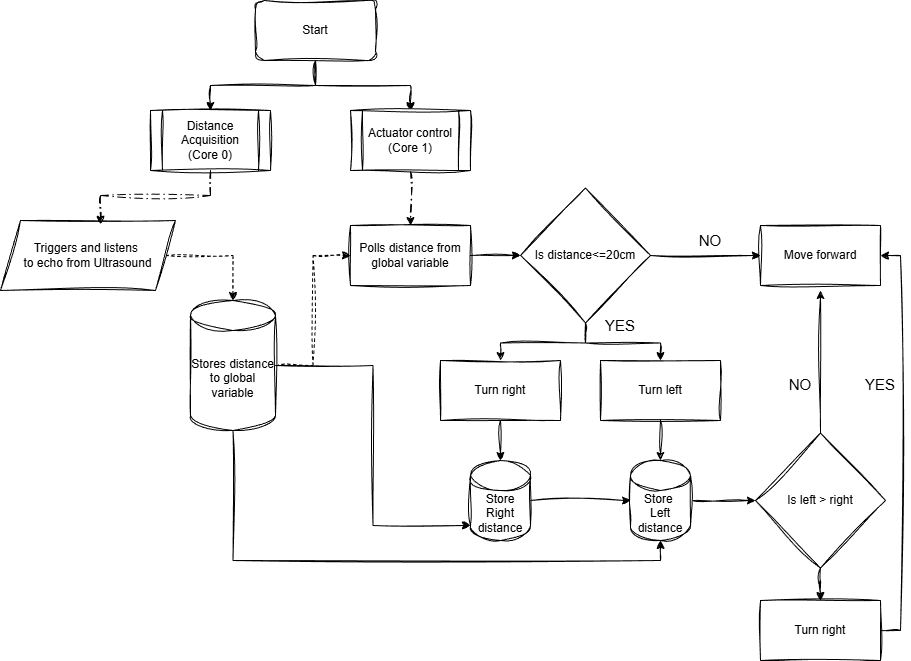

# Volumetrically Optimized Obstacle Avoidance Vechical

**Course:** Introduction to mechatronics (MKT-1821)  
**Instructor:** Prof. Haydar Livatyali & Associate Prof Erhan akdoğan  
**Softwares:** Weebot, arduinoIDE, SolidWorks, CrealityPrint 
**Focus:** Mechanical architecture, Electronic circuits, integrated sensing & control system design  
**Status:** Completed   

  

---

## Project Overview

is a compact, size‑optimized obstacle‑avoidance car designed as a CAD course capstone. The project emphasizes volumetric efficiency: a stacked, two‑layer electronic architecture and an overlapping motor/chassis arrangement reduce footprint while keeping components serviceable and mechanically robust. The mechanical structure was modeled and dimensioned in SolidWorks, and the electronics were implemented on a two‑layer perfboard stack to prioritize signal integrity and compactness.

This repository contains the project overview, circuit documentation, mechanical CAD deliverables, and a clear description of the onboard algorithm used for autonomous navigation.

---

## Highlights

- Two‑layer stacked electronics for high volumetric density and short routing paths.
- Overlapping motor/chassis design for compact footprint and improved yaw authority in tight spaces.
- Simple, robust autonomous algorithm optimized for single‑sensor ultrasonic scanning and low computational load.
- CAD deliverables: fully dimensioned chassis drawing, isometric views, and parts for fabrication.

---

  

## 1. Mechanical Design — Chassis

### Summary
The chassis uses an overlapping motor mount concept: the drive motors are arranged so their housings partially overlap with the main body plane. This overlapping reduces overall length while preserving wheelbase and turning capability. The main chassis was modeled parametrically in SolidWorks and exported as manufacturing drawings.

  

### Drawings & CAD:
- Chassis technical drawing: detailed, dimensioned views and an isometric illustration of the assembly.
- Project poster (overview): high‑level poster showing system architecture, workflow, and rendered isometrics.

### Mechanical considerations
- Kinematic smoothness: the geometry was tuned to keep wheel contact and minimize sudden shifts during turning maneuvers.
- Traction & interface: traction surfaces were optimized during prototyping; the final design uses uniform adhesive strips to stabilize wheel grip without increasing slip.
- Assembly & serviceability: the chassis allows the stacked electronics to slide in/out of a slot for quick access to the controller and power modules.

---

## 2. Electrical Circuit — Stacked Architecture

### Summary
The electronic system is implemented as a vertical, two‑board stack. This approach concentrates motors, battery management, power conversion, and sensing into a compact column, dramatically reducing the vehicle's footprint while keeping wiring short to lower noise and latency.

### Visuals:

  

simplified schematic that documents power rails, motor driver connections (MX1508), the ultrasonic sensor (HC‑SR04), and the ESP32 control pins.

  

shows the physical arrangement of the ESP32 controller, step‑down regulator, and motor driver modules mounted on two stacked perfboards.

  

shows the two layers separated for clarity (controller layer and actuator/sensor layer).

---

## 3. Algorithm — Autonomous Control Logic

### Summary
The control algorithm implements a low‑compute, reliable avoidance strategy designed for single ultrasonic sensor hardware constraints. It uses a simple Scan & Pivot method: when an obstacle is detected within a safety threshold, the vehicle samples left and right clearance and selects the direction with greater free space.

### Flowchart:

  

### Algorithm (stepwise)
1. Distance Acquisition (Sensor Core): the ultrasonic sensor is triggered and the echo time is measured. The measured distance is stored in a global variable accessible to the actuator core.
2. Actuator Control (Actuator Core): the actuator routine polls the global distance variable at a fixed control rate and decides navigation commands.
3. Threshold check: if measured distance ≤ 20 cm, the avoidance routine is triggered. Otherwise the vehicle proceeds with forward motion.
4. Scan & Pivot sequence:
- Pivot the vehicle in place toward one side (e.g., right) and sample the distance.
- Return to center, pivot the opposite side (left) and sample the distance.
- Compare left and right distances.
- Select the direction with greater clearance and execute a predefined turning maneuver to re‑align the vehicle with its primary navigation objective.
Resume forward motion once the path ahead is clear.

### Implementation notes: 
- The control loop is split conceptually into two cores (sensor acquisition and actuation) to mimic RTOS‑style separation and keep latency low.
- The algorithm prioritizes simplicity and determinism to work on low‑power microcontrollers (ESP32) and under stochastic obstacle distributions.